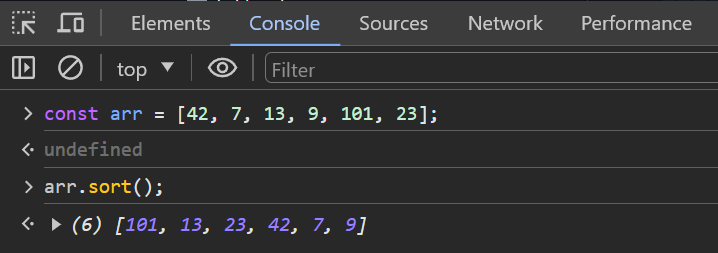

**_Problem_** : Imagine you are working at a magical bookstore called "Mystic Pages," where every book has a magical number assigned to it. One day, the Grand Librarian asks you to help organize the books. Each book’s magical number is stored in an array, and you need to sort these numbers in ascending order to ensure the books are placed correctly on the enchanted shelves.

Your task is to write a function in JavaScript that takes an array of magical numbers (only numbers) and sorts them in ascending order.

Write a function named sortMagicalNumbers that accepts an array arr of numbers and returns a new array with the numbers sorted.

Example:

```
   const books = [42, 7, 13, 9, 101, 23];
    console.log(sortMagicalNumbers(books));
    // Output: [7, 9, 13, 23, 42, 101]


```

**_Solution_**:

```
   function sortMagicalNumbers(arr) {
       return arr.sort((a, b) => a - b);
   }

    const books = [42, 7, 13, 9, 101, 23];
    console.log(sortMagicalNumbers(books));
    
```
### Why not arr.sort(); ?

**sort()** is a HOF ( Higher Order Function ) which take another function as an argument. By default in above example **arr.sort()** is going to sort the array in ***lexicographical*** order.

```
0 -> A
1 -> B
2 -> C
3 -> D
4 -> E
5 -> F
6 -> G
7 -> H
8 -> I
9 -> J
```
the **arr.sort()** arrange numbers according to dictonary.
```
-> [42, 7, 13, 9, 101, 23]
-> [EC, H, BD, J, BAB, CD]

// after arr.sort();

-> [BAB, BD, CD, EC, H, J]
-> [101, 13, 23, 42, 7, 9]
```

