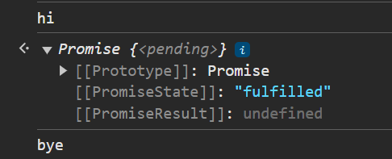

**_Problem_**: In languages like Java and Python, a sleep function is available to suspend execution of the calling thread. However, unlike other languages, JavaScript is single-threaded and blocking the main thread is not a good idea. Hence lets implement an asynchronous version of the sleep function that works similarly but does not block the main thread.

Example:

```
  async function greeting() {
    console.log('hi');
    await sleep(3000);
    console.log('bye'); // Only logs after 3000 milliseconds (3 seconds)
  }

  greeting();

```

**_Solution_**:

```
  function sleep(ms) {
    return new Promise((res, rej) => {
      setTimeout(res, ms);
    });
  }

  async function greeting() {
    console.log('hi');
    await sleep(3000);
    console.log('bye');
  }

  greeting();

```

**_Output_**:

```
hi
bye // after 3 seconds

```
